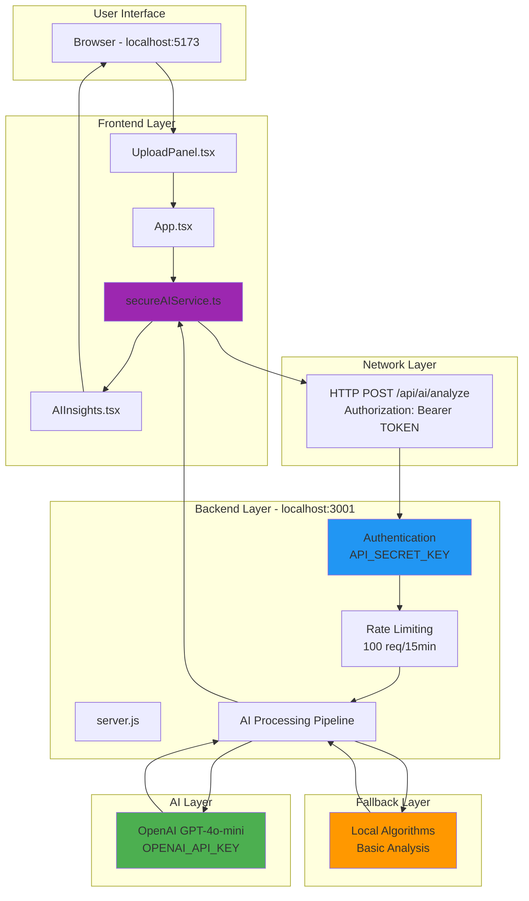

```mermaid
graph TB
    subgraph "User Interface"
        UI[Browser - localhost:5173]
    end
    
    subgraph "Frontend Layer"
        APP[App.tsx]
        UPLOAD[UploadPanel.tsx]
        AI_SERVICE[secureAIService.ts]
        AI_INSIGHTS[AIInsights.tsx]
    end
    
    subgraph "Network Layer"
        API_CALL[HTTP POST /api/ai/analyze<br/>Authorization: Bearer TOKEN]
    end
    
    subgraph "Backend Layer - localhost:3001"
        SERVER[server.js]
        AUTH[Authentication<br/>API_SECRET_KEY]
        RATE[Rate Limiting<br/>100 req/15min]
        AI_PROCESS[AI Processing Pipeline]
    end
    
    subgraph "AI Layer"
        OPENAI[OpenAI GPT-4o-mini<br/>OPENAI_API_KEY]
    end
    
    subgraph "Fallback Layer"
        LOCAL[Local Algorithms<br/>Basic Analysis]
    end
    
    UI --> UPLOAD
    UPLOAD --> APP
    APP --> AI_SERVICE
    AI_SERVICE --> API_CALL
    API_CALL --> AUTH
    AUTH --> RATE
    RATE --> AI_PROCESS
    AI_PROCESS --> OPENAI
    AI_PROCESS --> LOCAL
    OPENAI --> AI_PROCESS
    LOCAL --> AI_PROCESS
    AI_PROCESS --> AI_SERVICE
    AI_SERVICE --> AI_INSIGHTS
    AI_INSIGHTS --> UI
    
    style OPENAI fill:#4CAF50
    style LOCAL fill:#FF9800
    style AUTH fill:#2196F3
    style AI_SERVICE fill:#9C27B0
```
