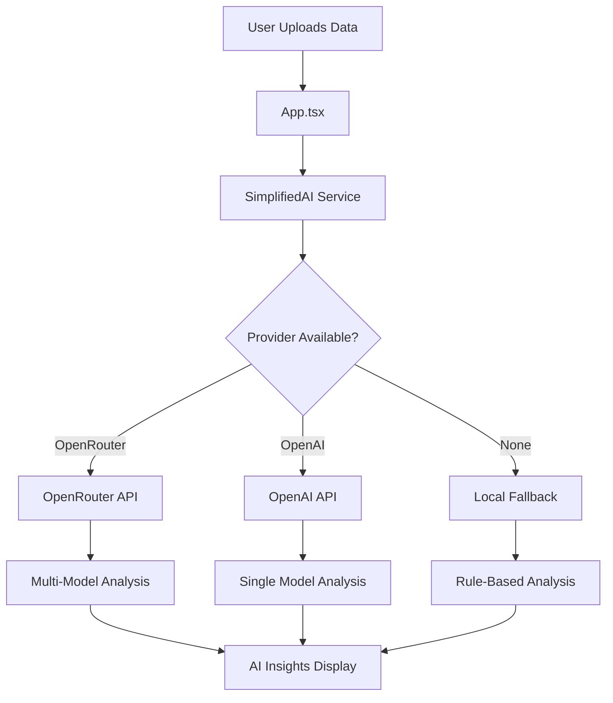
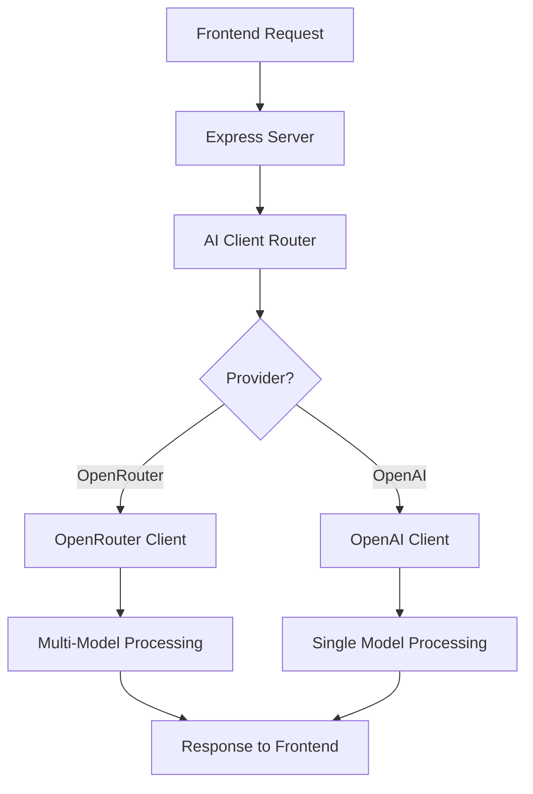

# 🌟 OpenRouter.ai Integration Guide

## 📋 **Implementation Complete!**

OpenRouter.ai has been successfully integrated into your Performance Insights Dashboard with full multi-model support, automatic fallback, and enhanced security features.

## 🎯 **What's New**

### ✅ **Multi-Model AI Access**
- **Primary**: OpenAI GPT-4o Mini (cost-effective, fast)
- **Fallback**: Anthropic Claude 3.5 Sonnet (different provider)
- **Budget**: Meta Llama 3.1 8B (ultra-low cost)
- **Alternative**: Google Gemini Flash 1.5 (fast, affordable)

### ✅ **Intelligent Provider Routing**
```typescript
OpenRouter (Primary) → OpenAI (Fallback) → Local Analysis
```

### ✅ **Enhanced Security**
- GitHub secret scanning integration
- Automatic key compromise detection
- Site attribution for usage tracking
- Rate limiting and spending controls

---

## 🔧 **Quick Setup (5 minutes)**

### **1. Get OpenRouter API Key**
```bash
# Visit: https://openrouter.ai/keys
# Create account and get your API key
```

### **2. Configure Frontend Environment**
```bash
# Copy template to .env.local
cp env-config-template.txt .env.local

# Edit .env.local with your API key:
VITE_OPENROUTER_API_KEY=your_openrouter_api_key_here
VITE_SITE_URL=http://localhost:5173
VITE_SITE_NAME=Performance Insights Dashboard
```

### **3. Configure Backend (Optional)**
```bash
# Copy template to backend .env
cp ai-api-server/config-template.txt ai-api-server/.env

# Edit ai-api-server/.env with your API key:
OPENROUTER_API_KEY=your_openrouter_api_key_here
```

### **4. Start the Application**
```bash
# Option 1: Full stack (frontend + backend)
npm run start:dev

# Option 2: Frontend only (uses OpenRouter directly)
npm run dev
```

---

## 🎛️ **Configuration Options**

### **Provider Priority**
The system automatically selects the best available provider:

```typescript
// 1. OpenRouter (if VITE_OPENROUTER_API_KEY is set)
//    - Multi-model access
//    - Cost controls
//    - Enhanced security

// 2. OpenAI Direct (if VITE_OPENAI_API_KEY is set)
//    - Single provider
//    - Direct integration

// 3. Local Analysis (fallback)
//    - Rule-based insights
//    - No API required
```

### **Model Selection**
```bash
# Environment Variables
VITE_PRIMARY_MODEL=openai/gpt-4o-mini        # Default: Cost-effective
# VITE_PRIMARY_MODEL=anthropic/claude-3.5-sonnet  # Alternative: High quality
# VITE_PRIMARY_MODEL=meta-llama/llama-3.1-8b      # Alternative: Ultra-low cost
```

### **Feature Flags**
```bash
VITE_AI_ANOMALY_DETECTION=true    # AI-powered anomaly detection
VITE_AI_SMART_SUGGESTIONS=true    # Intelligent optimization tips
VITE_AI_ROOT_CAUSE=true           # Root cause analysis
VITE_AI_PREDICTIONS=true          # Performance predictions
```

---

## 🔄 **How It Works**

### **Frontend Flow**


### **Backend Flow (Optional)**


---

## 📊 **Benefits Achieved**

### **🎯 Cost Management**
- **Spending Controls**: Set API key limits in OpenRouter dashboard
- **Usage Tracking**: Real-time cost monitoring
- **Model Optimization**: Choose models based on cost vs. quality needs

### **🔒 Enhanced Security**
- **Secret Scanning**: Automatic detection of exposed keys
- **Key Monitoring**: Email alerts for compromise detection
- **Site Attribution**: Track usage by application

### **⚡ Reliability**
- **Multi-Provider**: No single point of failure
- **Automatic Fallback**: Seamless model switching
- **Local Backup**: Always-available basic analysis

### **🚀 Performance**
- **Model Selection**: Choose optimal model per use case
- **Parallel Processing**: AI insights + explanations simultaneously
- **Caching**: 5-minute cache for repeated queries

---

## 🧪 **Testing Your Integration**

### **1. Test OpenRouter Connection**
```bash
# Start the app
npm run dev

# Check browser console for:
# "🌟 SimplifiedAI initialized with OpenRouter"
# "🎯 Primary model: openai/gpt-4o-mini"
# "🔑 API Keys available: { openrouter: true }"
```

### **2. Load Sample Data**
```bash
# Use the "Load Sample Data" button in the UI
# Or upload your own performance JSON files
```

### **3. Verify AI Analysis**
```bash
# Check console for:
# "🌟 Trying OpenRouter model: openai/gpt-4o-mini"
# "✅ OpenRouter success with model: openai/gpt-4o-mini"
# "🎯 Parsed AI insights: [array of insights]"
```

### **4. Test Fallback**
```bash
# Temporarily remove VITE_OPENROUTER_API_KEY
# Restart app - should fall back to OpenAI or local analysis
```

---

## 🐛 **Troubleshooting**

### **No AI Insights Showing**
```bash
# Check environment variables
echo $VITE_OPENROUTER_API_KEY

# Check browser console for errors
# Look for "🌟 OpenRouter" or "🔄 OpenAI" initialization messages

# Verify API key validity at: https://openrouter.ai/activity
```

### **API Rate Limits**
```bash
# OpenRouter has generous rate limits
# Check usage at: https://openrouter.ai/activity
# Set spending limits in OpenRouter dashboard
```

### **Model Failures**
```bash
# System automatically tries fallback models:
# 1. openai/gpt-4o-mini
# 2. anthropic/claude-3.5-sonnet  
# 3. meta-llama/llama-3.1-8b-instruct
# 4. Local analysis (if all fail)
```

---

## 💰 **Cost Optimization**

### **Model Cost Comparison**
| Model | Cost Level | Speed | Quality | Use Case |
|-------|------------|-------|---------|----------|
| `meta-llama/llama-3.1-8b` | Ultra-Low | Fast | Good | Budget analysis |
| `openai/gpt-4o-mini` | Low | Fast | Excellent | **Recommended** |
| `anthropic/claude-3.5-sonnet` | Medium | Medium | Excellent | Complex analysis |
| `google/gemini-flash-1.5` | Low | Fast | Good | Alternative option |

### **Cost Controls**
```bash
# Set spending limits in OpenRouter dashboard
# Monitor usage: https://openrouter.ai/activity
# Use model selection for cost optimization:

VITE_PRIMARY_MODEL=meta-llama/llama-3.1-8b-instruct  # Lowest cost
VITE_PRIMARY_MODEL=openai/gpt-4o-mini                 # Balanced (default)
VITE_PRIMARY_MODEL=anthropic/claude-3.5-sonnet       # Highest quality
```

---

## 🔮 **Advanced Features**

### **Custom Model Priority**
```typescript
// In src/config/ai.ts, modify:
fallbackModels: [
  'your-preferred-model',
  'openai/gpt-4o-mini',
  'anthropic/claude-3.5-sonnet'
]
```

### **Usage Analytics**
```typescript
// Get OpenRouter usage info
const usage = await openRouterService.getUsageInfo();
console.log('Credits remaining:', usage);
```

### **Custom Prompts**
```typescript
// Modify system prompts in:
// - src/services/openRouterService.ts
// - src/utils/simplifiedAI.ts
```

---

## 📚 **Resources**

- **OpenRouter Dashboard**: https://openrouter.ai/activity
- **API Documentation**: https://openrouter.ai/docs
- **Model Comparison**: https://openrouter.ai/models
- **Cost Calculator**: https://openrouter.ai/models (pricing column)

---

## ✅ **Implementation Status**

- [x] **OpenRouter Service** - Multi-model support with fallback
- [x] **Provider Routing** - Intelligent selection (OpenRouter → OpenAI → Local)
- [x] **Configuration** - Environment templates and validation
- [x] **Security** - GitHub scanning, key monitoring, site attribution
- [x] **Backend Support** - Express server with OpenRouter integration
- [x] **Frontend Integration** - Enhanced SimplifiedAI service
- [x] **Error Handling** - Comprehensive fallback strategies
- [x] **Documentation** - Complete setup and troubleshooting guide

## 🎉 **Next Steps**

1. **Get OpenRouter API Key**: https://openrouter.ai/keys
2. **Configure Environment**: Update `.env.local` with your API key
3. **Test Integration**: Run `npm run dev` and load sample data
4. **Monitor Usage**: Check https://openrouter.ai/activity
5. **Optimize Costs**: Adjust model selection based on usage patterns

Your Performance Insights Dashboard now has enterprise-grade AI capabilities with built-in cost controls, enhanced security, and multi-provider reliability! 🚀
